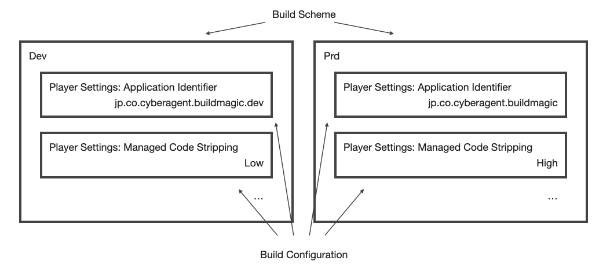
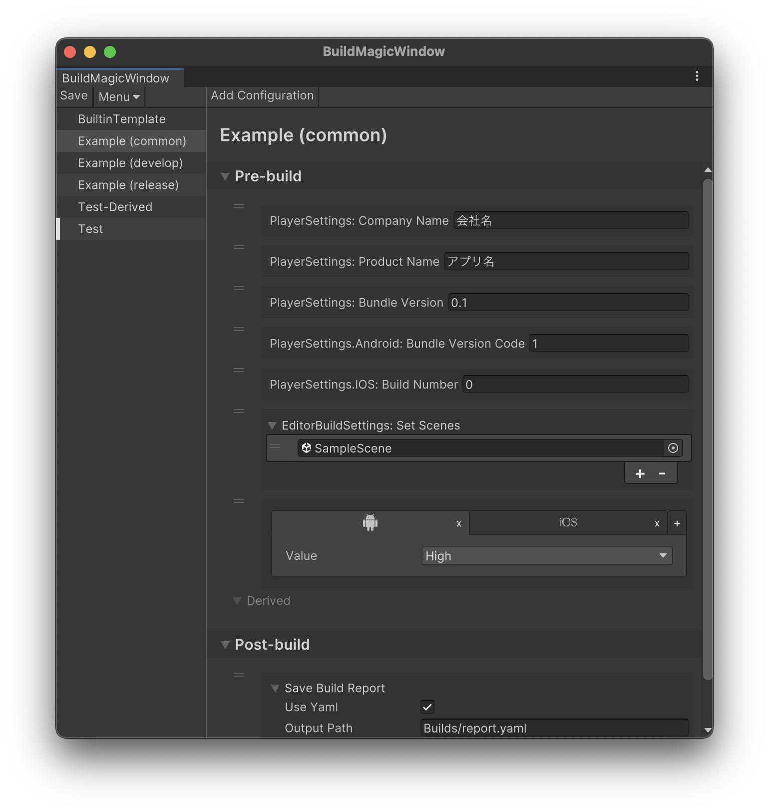
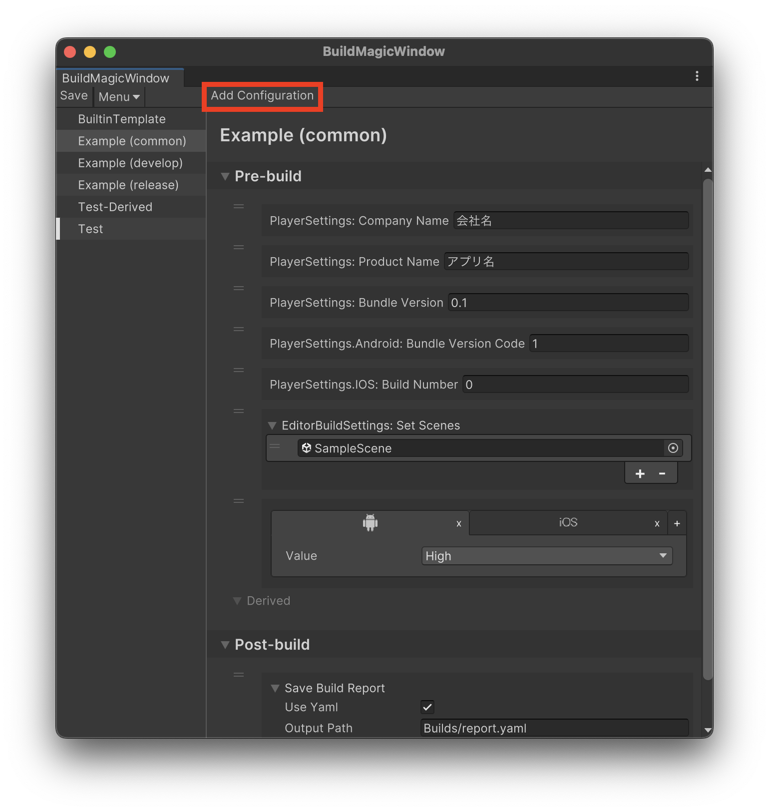
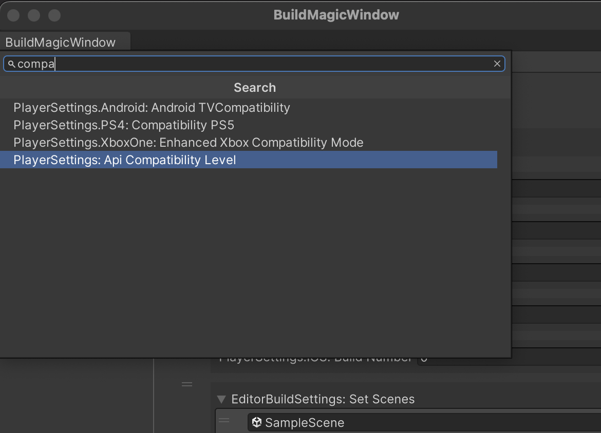
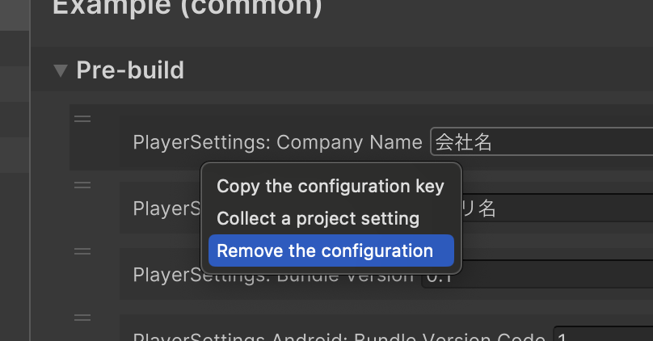
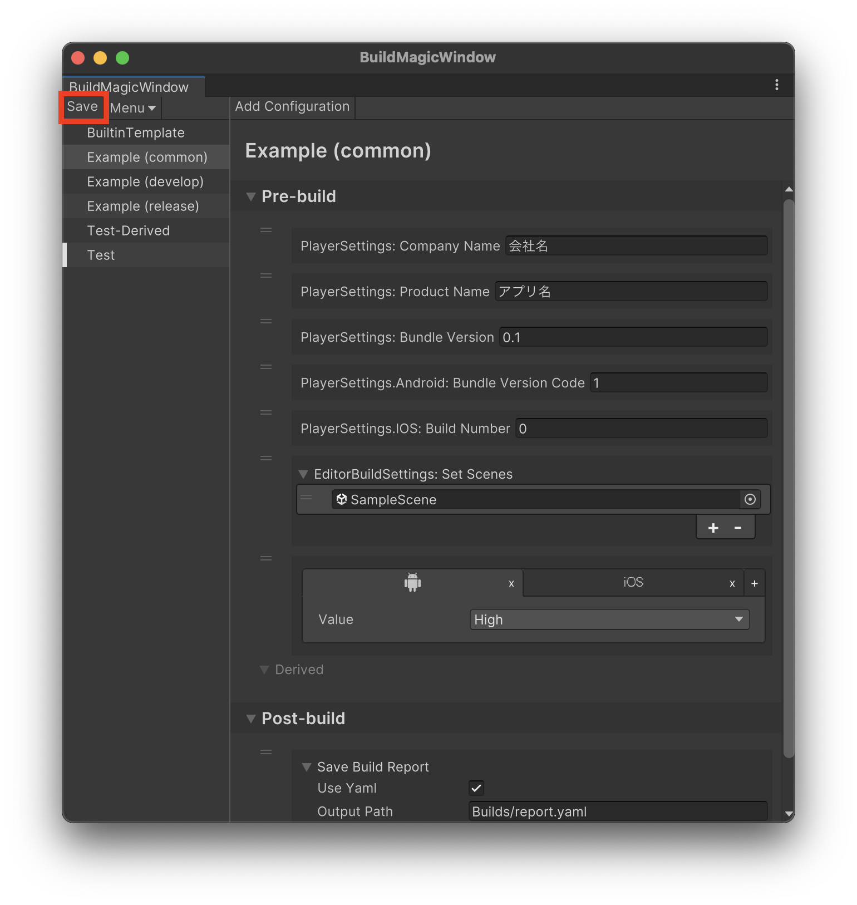
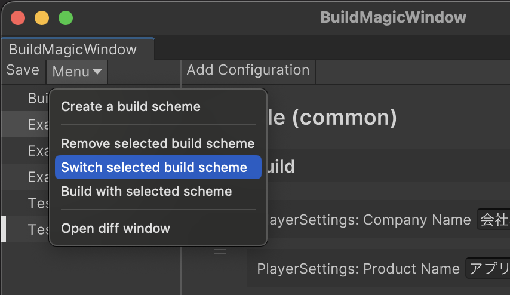
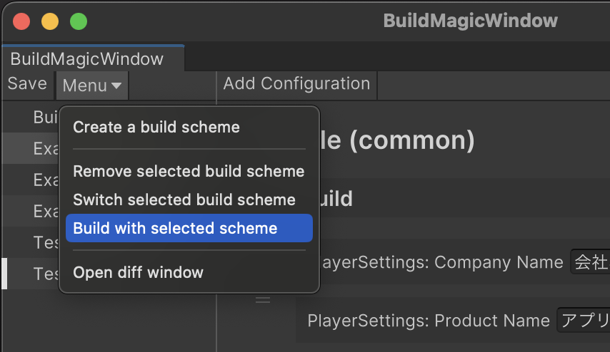
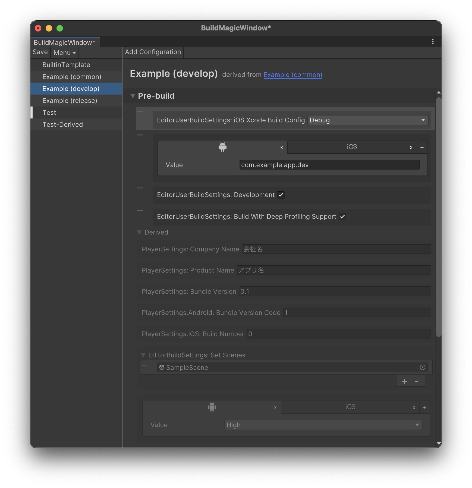
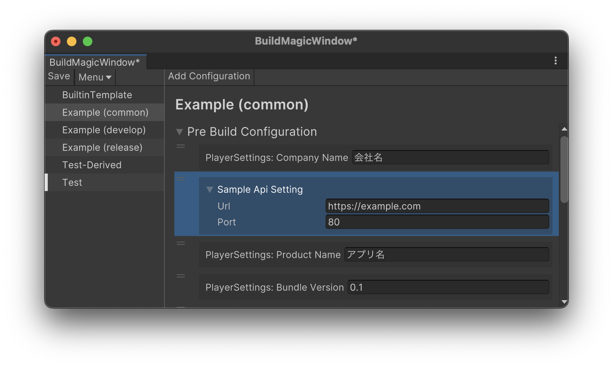

BuildMagic
==========

[](LICENSE)
[](https://github.com/CyberAgentGameEntertainment/BuildMagic/pulls)
[](#インストール)

English: [README.md](./README.md)

BuildMagicは、開発・本番などの複数の設定を管理し、ビルドパイプラインの構築をサポートするビルドユーティリティです。
ユーザーフレンドリーなインターフェイスを提供し、特にUnityのアプリビルドでよく必要になるビルドタスクをビルトインで提供します。

<!-- TOC -->
* [BuildMagic](#buildmagic)
  * [モチベーション](#モチベーション)
  * [BuildMagicの構成](#buildmagicの構成)
  * [機能](#機能)
    * [Unity の Build Profiles との相違点](#unity-の-build-profiles-との相違点)
  * [Quick Start](#quick-start)
    * [インストール](#インストール)
    * [ビルドスキームの作成](#ビルドスキームの作成)
    * [ビルドコンフィギュレーションの追加と編集](#ビルドコンフィギュレーションの追加と編集)
    * [ビルドスキームの切り替え](#ビルドスキームの切り替え)
    * [UI上からのビルド](#ui上からのビルド)
    * [ビルドスキームの継承](#ビルドスキームの継承)
  * [コマンドラインインターフェイス（CLI）からアプリをビルドする](#コマンドラインインターフェイスcliからアプリをビルドする)
    * [ビルド時のビルドコンフィギュレーションの上書き](#ビルド時のビルドコンフィギュレーションの上書き)
  * [ビルドタスク](#ビルドタスク)
    * [独自のビルドタスクを実装する](#独自のビルドタスクを実装する)
    * [プロジェクトの設定をビルドコンフィギュレーションに反映する](#プロジェクトの設定をビルドコンフィギュレーションに反映する)
    * [ビルトインのビルドコンフィギュレーション](#ビルトインのビルドコンフィギュレーション)
<!-- TOC -->

## モチベーション

Unityのアプリをビルドする際、開発時や本番時などで異なる設定を適用する必要があります。

例えば、`PlayerSettings` などのUnity標準のAPIに対する設定もあれば、アプリケーションの接続先サーバーのURLや導入したSDKの設定など、プロジェクト独自の設定もあります。

Build Magicは複数のビルド設定を効率よく管理し、設定を適用するためのUI/CIインターフェースを提供します。

PlayerSettings や EditorUserBuildSettings などのUnity標準の全てのAPIについては、標準の設定画面にないものも含めてノーコードで設定の変更を行えるようになっているため、設定の負担が軽減されています。

また、プロジェクト固有の設定については、拡張APIを使用することで同じUI上で管理できます。

BuildMagicではビルドパイプラインの実行やアプリビルドのためのCLIを標準で用意しているため、GitHub ActionsやJenkins上でのアプリビルドを簡単に行うことができます。

Unity上のUIを通してビルド設定を管理できるようにすることで、CI側の管理負担を減らすことができます。コマンドライン引数によってパラメータを部分的にオーバーライドすることも可能なので、CIによるアドホックなビルド設定の変更も可能です。

## BuildMagicの構成

BuildMagicでは、開発・本番などの設定を **ビルドスキーム (Build Scheme)** という単位で管理します。

ビルドスキームは複数の **ビルドコンフィギュレーション (Build Configuration)** を持ちます。

ビルドコンフィギュレーションは、バンドルIDの設定やアプリケーションアイコンなど実際の設定を行う実装として **ビルドタスク** を提供し、ビルドタスクに渡されるパラメーターを保持しています。

以下の図に、ビルドスキーム、ビルドコンフィギュレーション、ビルドタスクの関係を示します。



## 機能

- **複数のビルドスキームの管理** : 複数のビルドスキームを保持することができ、開発・本番などの設定の切り替えを簡単に行うことができます。
- **ビルトインのビルドコンフィギュレーションの提供** : `PlayerSettings` や `EditorUserBuildSettings` の操作など、よく必要になるビルドコンフィギュレーションをビルトインで提供します。
- **独自のビルドコンフィギュレーションの実装**: 独自のビルドコンフィギュレーションを用意することで、容易にビルドパイプラインを拡張することができます。
- **コマンドラインのサポート**: CI/CDツールからの利用を想定し、コマンドライン経由での設定の切り替えや、ビルドの実行をサポートします。

### Unity の Build Profiles との相違点

Unity 6 以降では、Build Profilesという標準機能によって複数のビルド設定を切り替えてビルドできるようになりました。

BuildMagic は Build Profiles とは異なり、ビルド設定だけではなくそれを包括するビルドパイプラインとして、より抽象的な概念を提供します。

また、次のような機能上の差異があります。

- **部分的な設定の適用**: Build ProfilesではPlayerSettings等の適用を一括で行いますが、BuildMagicでは各設定項目ごとにビルドコンフィギュレーションが定義されており、個別の項目のみをオーバーライドできます。
- **拡張性**: BuildMagicではビルドコンフィギュレーションを独自に実装することで、プロジェクト固有の設定を管理できます。
- **管理性**: BuildMagicのビルドスキームは、人間にも読みやすいJSON形式でシリアライズされます。

## Quick Start

### インストール

Unity 2022.3.12f1以降に対応しています。

Package Managerから以下の git URL を追加してください：

```
https://github.com/CyberAgentGameEntertainment/BuildMagic.git?path=/Packages/jp.co.cyberagent.buildmagic
```

### ビルドスキームの作成

新しいビルドスキームを追加するには、BuildMagicウインドウを利用します。

「メニュー > Window > Build Magic」を選択し、「BuildMagic」ウィンドウを開きます。



次に、BuildMagicウインドウの左上にある「Menu」をクリックしてでプルダウンメニューを展開し、「Create a build scheme」を選択します。


すると、「Build Scheme Creator」ウインドウが開きます。
ここで「Name」フィールドに新しいビルドスキームの名前を入力し、「Create」ボタンをクリックすることで新しいビルドスキームを作成できます。


なお、「Copy from」を指定することで、指定したスキームを元に新たなビルドスキームを作成することも可能です。


> [!NOTE]
> **Base** については、[ビルドスキームの継承](#ビルドスキームの継承)をご覧ください。

### ビルドコンフィギュレーションの追加と編集

まず、「BuildMagic」ウィンドウを開き、左側のペインから編集対象のビルドスキームを選択します。



新たなビルドコンフィギュレーションを追加するためには、右側のペインの左上にある「Add Configuration」をクリックします。

次に、下図のように表示されるドロップダウンメニューから、追加したいビルドコンフィギュレーションを選択します。



選択後、BuildMagicウィンドウの右側のペインにビルドコンフィギュレーションが追加されます。ここで、その設定値を編集します。

ビルドコンフィギュレーションには、実行されるタイミングに応じて「PreBuild」、「PostBuild」の2つのフェーズがあります。
フェーズの詳細については[コマンドラインインターフェイス（CLI）からアプリをビルドする](#コマンドラインインターフェイスcliからアプリをビルドする)
に記載しています。

ビルドコンフィギュレーションを削除する場合は、削除対象のビルドコンフィギュレーション上で右クリックし、「Remove the configuration」を選択します。



プロジェクトの設定をビルドコンフィギュレーションに反映させる場合は、反映対象のビルドコンフィギュレーション上で右クリックし、「Collect a project setting」を選択します。


設定の編集が完了したら、「Save」ボタンをクリックして設定を保存します。



### ビルドスキームの切り替え

Unityプロジェクトの設定を選択したビルドスキームのものに切り替えるには、左ペインで反映させたいビルドスキームを選択します。
その後、BuildMagicウインドウの画面左上にある「Menu」をクリックしてプルダウンメニューを開き、「Switch selected build scheme」を選択します。



### UI上からのビルド

BuildMagicウインドウの画面左上にある「Menu」をクリックしてプルダウンメニューを開き、「Build with selected scheme」を選択することでアプリをビルドできます。



### ビルドスキームの継承

あるビルドスキームを継承し、設定の追加または上書きをすることができます。

ビルドスキームを作成する際、継承元となるビルドスキームを **Base** として指定してください。
他のビルドスキームを継承して作成したビルドスキームをUI上で選択すると、**Derived** という項目に継承元のビルドスキームに含まれるビルドコンフィギュレーションが表示されます。
設定の追加・上書きは**ビルドコンフィギュレーション単位**で行われます。

ビルドスキームをツリービュー上でドラッグ&ドロップすることで、作成済みのビルドスキームの継承関係を変更することも可能です。ツリービュー上で、ビルドスキームはその**Base**となるビルドスキームの下の階層に表示されます。



## コマンドラインインターフェイス（CLI）からアプリをビルドする

BuildMagicは、コマンドライン経由での実行をサポートしています。

BuildMagicにおけるビルドタスクの実行は「PreBuildフェーズ」と「PostBuildフェーズ」の2つのフェーズに分かれています。

- PreBuildフェーズ:
    - プラットフォームの切り替えと、BuildMagicが管理するビルド設定をプロジェクトに適用するフェーズです。
    - Define Symbolsの更新やアセット、ソースコードの物理削除はこのフェースで行います。
- PostBuildフェーズ:
    - Unityアプリをビルドした後に実行されるフェーズです

コマンドライン経由の実行では、PreBuildフェーズを実行してからUnityを再起動し、アプリビルド・PostBuildフェーズを実行します。

このアプローチを採用しているのは、コマンドライン経由のバッチモード実行ではドメインリロードができないためです。
プラットフォームやDefine Symbolsの更新を行った同じプロセスでビルドを実行すると、コードの再コンパイルが正常に行われず、期待したビルドが得られない可能性があります。

参考: [Unity - Manual: Custom scripting symbols](https://docs.unity3d.com/Manual/CustomScriptingSymbols.html)

> So, for example, if you use this method in an Editor script, then immediately call BuildPipeline.BuildPlayer on the
> following line in the same script, at that point Unity is still running your Editor scripts with the old set of
> scripting symbols, because they have not yet been recompiled with the new symbols.
> This means if you have Editor scripts which run as part of your BuildPlayer execution,
> they run with the old scripting symbols and your player might not build as you expected.

以下は、macOS上でCLIを利用してビルドを実行する例です。

```shell
# プレビルドフェーズの実行
/Path/to/Unity -projectPath /Path/To/Project -quit -batchmode -executeMethod BuildMagicCLI.PreBuild \
  -scheme ${BUILD_MAGIC_SCHEME_NAME} \
  -override KEY1=VALUE1 -override KEY2=VALUE2

# アプリビルドとポストビルドフェーズの実行
/Path/to/Unity -projectPath /Path/To/Project -quit -batchmode -executeMethod BuildMagicCLI.Build \
  -scheme ${BUILD_MAGIC_SCHEME_NAME} \
  -override KEY1=VALUE1 -override KEY2=VALUE2
```

コマンドラインのオプション引数は下記のとおりです。

| オプション引数     | 説明                                     | 型           |
|:------------|:---------------------------------------|:------------|
| `-scheme`   | 適用するビルドスキームの名前を指定します。                  | string      |
| `-override` | ビルドコンフィギュレーションの値を上書きします。               | string      |
| `-strict`   | ビルド中に一つでもエラーログ出力があれば、ビルド結果に関わらず失敗とします。 | bool (flag) |

コマンドラインの戻り値は、下記のとおりです。

| 戻り値   | 説明                              |
|:------|:--------------------------------|
| `0`   | ビルドが正常に完了した際に返却されます。            |
| `0以外` | ビルド中に例外が投げられるなどで異常終了した際に返却されます。 |

### ビルド時のビルドコンフィギュレーションの上書き

ビルドコンフィギュレーションの各設定値は、CLI実行時に `-override` オプションを指定することで上書きが可能です。`-override` は、`KEY=VALUE` の形式で指定します。

KEYには、書き換えたいビルドスキームのキー値を指定します。
このキー値は、`BuildTaskBase<T>` を継承するクラスにつけた `GenerateBuildTaskAccessories` 属性の `PropertyName` で指定した値になります。

実際のキー値は、下図のようにBuildMagicウインドウでビルドスキームカーソルを合わせて右クリックし、「Copy the configuration key」を選択することでクリップボードにコピーできます。


また、指定したビルドスキーム内に該当するビルドコンフィギュレーションが存在しない場合は、新たにビルドコンフィギュレーションが作成されビルドタスクが実行されます。

## ビルドタスク

BuildMagicでは、 `BuildTaskBase<T>` を用いてビルドタスクを定義します。

例えば、アプリケーションの名前を設定するためのビルトインタスク `PlayerSettingsSetProductNameTask` は、次のように `BuildTaskBase<T>` を継承して実装されています。

```csharp
[BuildMagicEditor.GenerateBuildTaskAccessories(@"PlayerSettings: Product Name", PropertyName = @"PlayerSettings.ProductName")]
public class PlayerSettingsSetProductNameTask : BuildMagicEditor.BuildTaskBase<BuildMagicEditor.IPreBuildContext>
{
    public PlayerSettingsSetProductNameTask(string productName)
    {
        this.productName = productName;
    }

    public override void Run(BuildMagicEditor.IPreBuildContext context)
    {
        UnityEditor.PlayerSettings.productName = this.productName;
    }
    private readonly string productName;
}
```

型パラメータ `T` は、このタスクがどのフェーズで実行されるかを表すコンテキスト型です。

BuildMagicでは、ビルドタスクを実行するフェーズを以下の3つに分けています。

| Phase     | Description                           | ContextType         |
|:----------|:--------------------------------------|:--------------------|
| PreBuild  | プロジェクトへ設定を適用するフェーズ。ビルドフェーズの手前に実行されます。 | `IPreBuildConetxt`  | 
| PostBuild | ビルドプレイヤーによるアプリケーションのビルド後に実行されるフェーズ。   | `IPostBuildContext` | 

「PreBuildフェーズでは、Unityプロジェクトへの各種設定の反映、Script Define Symbolsの適用、および物理的なコードの除外などによるC#コードの更新を行います。

「PostBuild」フェーズでは、ビルドされたアプリケーションやプロジェクトに対して追加の処理を実行します。

### 独自のビルドタスクを実装する

BuildMagicでは、独自のビルドタスクを定義することで、プロジェクト固有の設定を保持・反映することができます。

例えば、次のような `SampleApiSetting` という設定があるとします。

```csharp
using System;
using UnityEngine;

[CreateAssetMenu(
    fileName = "SampleApiSettings",
    menuName = "Build Magic/Samples/Sample ApiSettings")]
[Serializable]
public class SampleApiSetting : ScriptableObject
{
    [SerializeField] public string Url;

    [SerializeField] public int Port;
}
```

この設定をBuildMagicにより管理・反映するためのビルドタスクは、次のように実装します。

```csharp
using BuildMagicEditor;
using UnityEditor;

// BuildConfiguration等を自動生成するために必要な属性
[GenerateBuildTaskAccessories(
    // displayNameはBuildMagicウインドウで表示されるビルドコンフィギュレーションの名前
    "Sample Api Setting",
    // PropertyNameは後述するCLI実行でのビルド時のオーバーライドのキーとして利用する
    PropertyName = "SampleApiSetting")]
public class SampleApiSettingBuildTask : BuildTaskBase<IPreBuildContext>
{
    private readonly string _url;
    private readonly int _port;

    // この設定で更新で必要な値は、すべてタスクのコンストラクタ引数をとるようにする
    public SampleApiSettingBuildTask(string url, int port)
    {
        _url = url;
        _port = port;
    }

    public override void Run(IPreBuildContext context)
    {
        // 保持している設定をプロジェクトに反映する実装をRun内に記述する
        var setting = AssetDatabase.LoadAssetAtPath<SampleApiSetting>(
            "Assets/Settings/SampleApiSettings.asset");
        if (setting != null)
        {
            setting.Url = _url;
            setting.Port = _port;
            EditorUtility.SetDirty(setting);
        }
    }
}
```

ビルドタスクは `BuildTaskBase<T>`を継承して実装し、`T`には適用されるフェーズのコンテキスト型を指定します。
上記の実装では `IPreBuildContext` を指定しているため、プレビルドフェーズで実行されるビルドタスクとなります。

また、ビルドコンフィギュレーションの自動生成のために、`GenerateBuildTaskAccessories` 属性および `BuildConfiguration` 属性を付与します。
このビルドタスクに必要な設定値は、すべてコンストラクタ引数として受け取るように実装します。

実際のビルドタスクの処理は、`Run(T context)` メソッド内に記述します。

このような実装を行うことで、以下のようにBuildMagicに独自のビルドコンフィギュレーションを追加することができます。



### プロジェクトの設定をビルドコンフィギュレーションに反映する

生成されたビルドコンフィギュレーションに対して `IProjectSettingApplier` を実装することで、
プロジェクト側の設定をビルドコンフィギュレーションに反映することができます。

以下に、`SampleApiSettingBuildTaskConfiguration` に対する `IProjectSettingApplier` の実装例を示します。

```csharp
// SampleApiSettingBuildTaskというビルドタスクに対して、
// SampleApiSettingBuildTaskConfigurationという名前のビルドコンフィギュレーションが自動生成される
// このクラスはpartialで定義されているので、下記のようにpartialでIPorjectSettingApplierを実装する
public partial class SampleApiSettingBuildTaskConfiguration : IProjectSettingApplier
{
    void IProjectSettingApplier.ApplyProjectSetting()
    {
        // プロジェクト側の設定値を参照する
        var setting = AssetDatabase.LoadAssetAtPath<SampleApiSetting>("Assets/Settings/SampleApiSettings.asset");
        if (setting != null)
        {
            // Valueというプロパティに設定値を反映させる
            // SampleApiSettingBuildTaskに対して、
            // SampleApiSettingBuildTaskParametersというパラメータークラスが自動生成されるので
            // この値を設定することでビルドコンフィギュレーション側に設定値を反映させることができる
            Value = new SampleApiSettingBuildTaskParameters
            {
                port = setting.Port,
                url = setting.Url
            };
        }
    }
}

```

### ビルトインのビルドコンフィギュレーション

以下のビルドコンフィギュレーションは、BuildMagicにビルトインで提供されています。

* プレビルドフェーズに適用されるビルドコンフィギュレーション
    * [PlayerSettings](https://docs.unity3d.com/ja/2022.3/ScriptReference/PlayerSettings.html)
    * [EditorUserBuildSettings](https://docs.unity3d.com/ja/2022.3/ScriptReference/EditorUserBuildSettings.html)
* ビルドフェーズに適用されるビルドコンフィギュレーション
    * [BuildPlayerOptions](https://docs.unity3d.com/ja/2022.3/ScriptReference/BuildPlayerOptions.html)
