BuildMagic
==========

[](LICENSE)
[](https://github.com/CyberAgentGameEntertainment/BuildMagic/pulls)
[](#installation)

Japanese: [README.ja.md](./README.ja.md)

BuildMagic is a build utility that manages multiple configurations such as development and production, and supports building pipelines.
It provides a user-friendly interface and offers built-in task implementaions that are often needed, especially for Unity app builds.

<!-- TOC -->
* [BuildMagic](#buildmagic)
  * [Motivation](#motivation)
  * [Concept](#concept)
  * [Features](#features)
    * [Differences from Unity's Build Profiles](#differences-from-unitys-build-profiles)
  * [Quick Start](#quick-start)
    * [Installation](#installation)
    * [Creating a Build Scheme](#creating-a-build-scheme)
    * [Adding and Editing Build Configurations](#adding-and-editing-build-configurations)
  * [Switching Build Schemes](#switching-build-schemes)
    * [Building from the UI](#building-from-the-ui)
    * [Build Scheme Inheritance](#build-scheme-inheritance)
  * [Build Phases](#build-phases)
    * ["Just before the build" phase](#just-before-the-build-phase)
  * [Command-line Arguments](#command-line-arguments)
    * [Overriding Build Configuration at Build Time](#overriding-build-configuration-at-build-time)
  * [Build Tasks](#build-tasks)
    * [Implementing Custom Build Tasks](#implementing-custom-build-tasks)
    * [Reflecting Project Settings in Build Configurations](#reflecting-project-settings-in-build-configurations)
    * [Built-in Build Configurations](#built-in-build-configurations)
<!-- TOC -->

## Motivation

When building a Unity app, you need to apply different settings for different purposes such as development, production, etc.

For example, there are settings for `PlayerSettings` and other Unity standard APIs, as well as settings for the URL of the application's connection server and the configuration of the introduced SDK, etc., which are project-specific settings.

BuildMagic efficiently manages multiple sets of build settings and provides an interface to apply settings from UI and CI.

For all major Unity APIs, including `PlayerSettings` and `EditorUserBuildSettings`, you can change settings without code, even for settings that are not available in the standard settings screen, reducing the burden of settings.

For project-specific settings, you can manage them on the same UI by using the extension API.

BuildMagic provides a CLI for executing the build pipeline and building the app, making it easy to build apps on GitHub Actions or Jenkins.

By allowing you to manage build settings through the UI in Unity, you can reduce the management burden on CI. It is also possible to partially override parameters by command-line arguments, allowing you to make ad hoc changes to build settings in CI.

## Concept

In BuildMagic, build settings are managed in units called **Build Schemes**.

A Build Scheme can have multiple **Build Configurations**.

A Build Configuration provides a **Build Task**, which is an actual implementation to set settings such as the bundle ID and application icon, and parameters that are passed to the Build Task.

The following diagram shows the relationship between Build Schemes, Build Configurations, and Build Tasks.

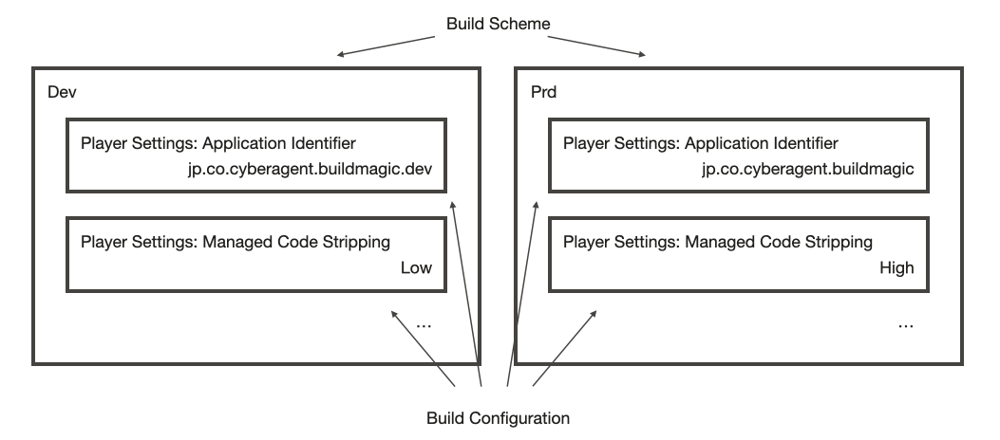

## Features

- **Manage multiple build schemes**: You can manage multiple build schemes such as "development" and "production", and easily switch between them.
- **Provide built-in build configurations**: Provides frequently needed build configurations such as `PlayerSettings` and `EditorUserBuildSettings`.
- **Implement custom build configurations**: By implementing custom build configurations, you can easily extend the build pipeline.
- **CLI support**: Supports switching schemes and building player via the CLI, making it easy to use from CI/CD workflows.

### Differences from Unity's Build Profiles

Build Profiles, which is a built-in feature since Unity 6, allows you to switch build settings and build apps.

BuildMagic provides a more abstract concept than Build Profiles, as it provides a build pipeline that includes build settings.

In addition, there are the following functional differences:

- **Partial setting application**: Build Profiles apply settings such as PlayerSettings in bulk, but BuildMagic defines build configurations for each setting item, allowing you to override individual items.
- **Extensibility**: By implementing build configurations in BuildMagic, you can manage project-specific settings.
- **Manageability**: Build schemes in BuildMagic are serialized in a human-readable JSON format.

> [!TIP]
> BuildMagic also provides `Switch Build Profile` task so that you can use BuildMagic in conjunction with Unity's Build Profiles.

## Quick Start

### Installation

BuildMagic supports Unity 2022.3.12f1 and later.

Add the following git URL to the Package Manager:

```
https://github.com/CyberAgentGameEntertainment/BuildMagic.git?path=/Packages/jp.co.cyberagent.buildmagic
```

### Creating a Build Scheme

To add a new build scheme, use the BuildMagic window.

Select `Menu > Window > Build Magic` to open the `BuildMagic` window.

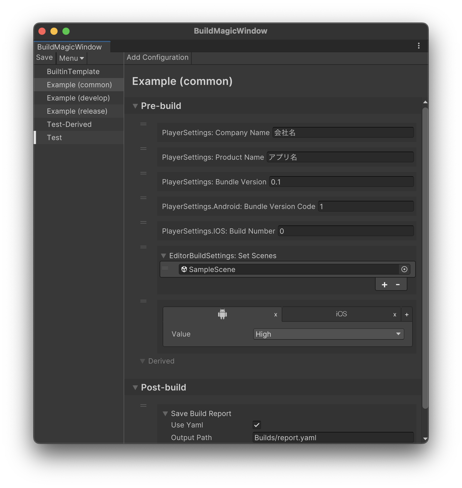

Next, click the `Menu` in the upper left corner of the BuildMagic window to expand the dropdown menu and select `Create a build scheme`.

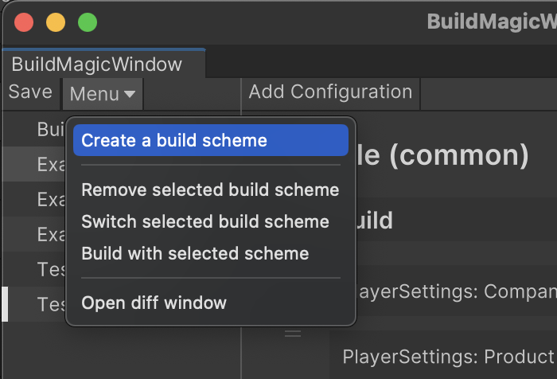

The `Build Scheme Creator` window will open.  
Enter the name of the new build scheme in the `Name` field and click the `Create` button to create a new build scheme.

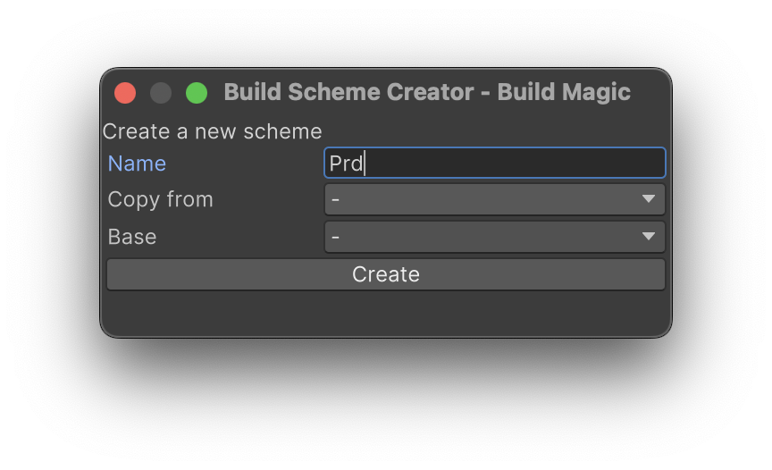

You can also create a new build scheme based on another build scheme by specifying `Copy from`.

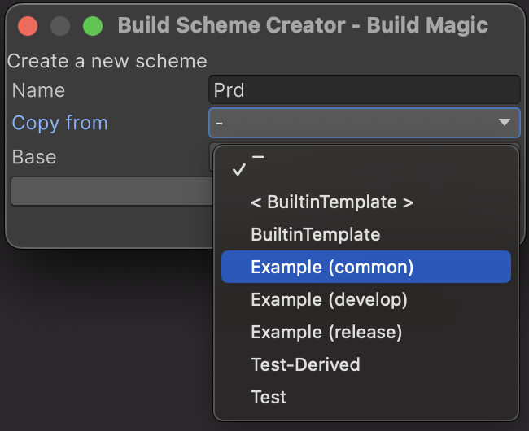

> [!NOTE]
> See [Build Scheme Inheritance](#build-scheme-inheritance) for more information on **Base**.

### Adding and Editing Build Configurations

First, open the `BuildMagic` window and select the build scheme you want to edit from the left pane.

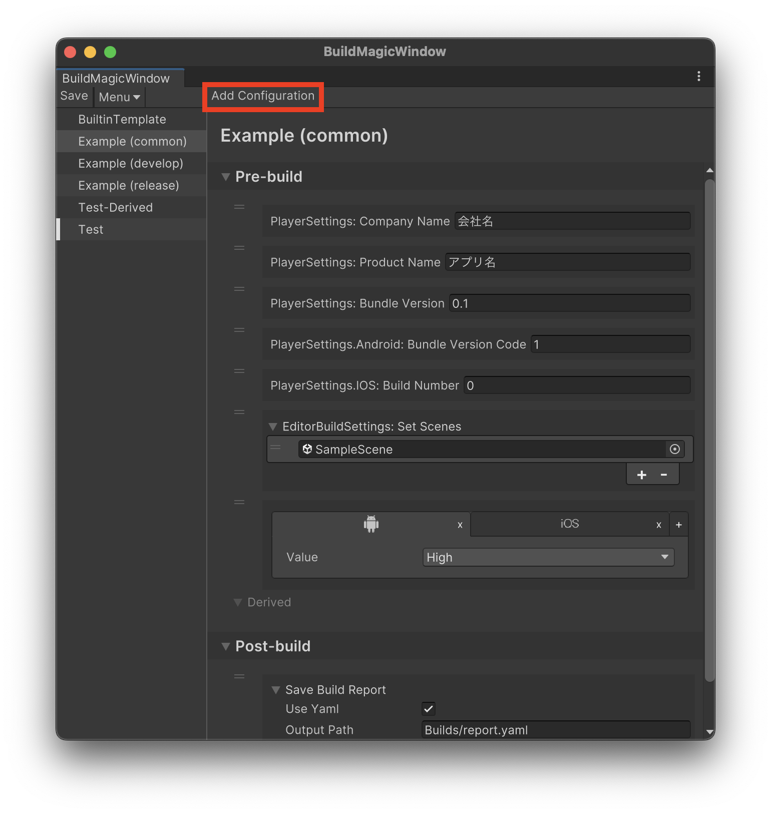

To add a new build configuration, click `Add Configuration` in the upper left of the right pane.

Next, select the build configuration you want to add from the dropdown menu that appears as shown below.

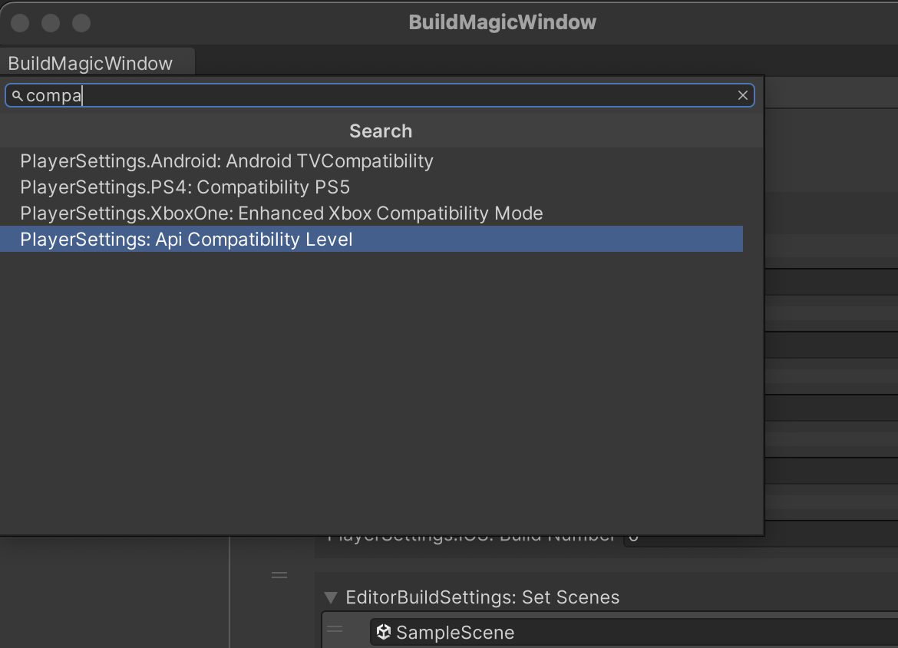

After selecting, the build configuration will be added to the right pane of the BuildMagic window. Edit the configuration values here.

Build configurations have two phases, `Pre-build` and `Post-build`, depending on when they are executed.  
For more information on the phases, see [Building an App from the CLI](#building-an-app-from-the-cli).

To delete a build configuration, right-click on the build configuration to be deleted and select `Remove the configuration`.

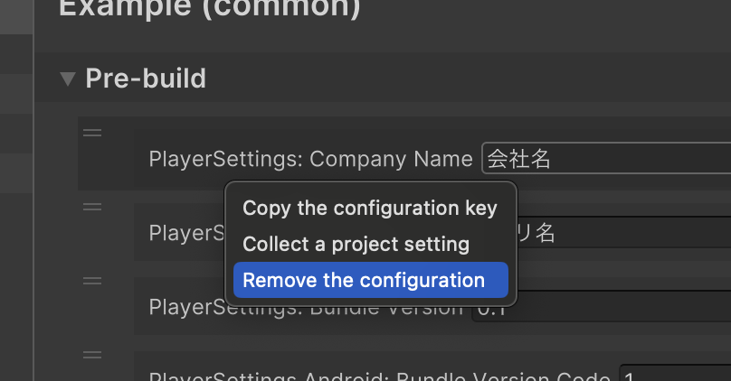

To reflect project settings in a build configuration, right-click on the build configuration to be reflected and select `Collect a project setting`.

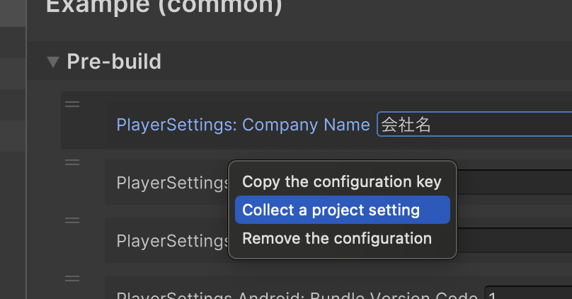

After editing the settings, click the `Save` button to save the settings.

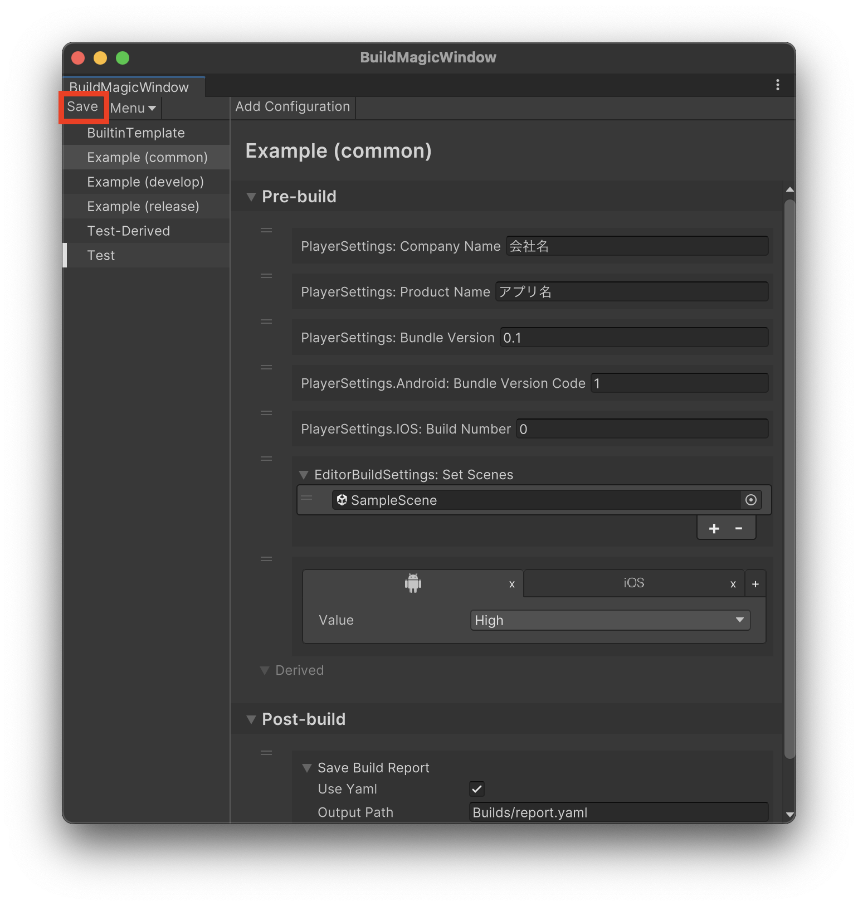

## Switching Build Schemes

To switch the Unity project settings to those of the selected build scheme, select the build scheme you want to apply in the left pane.

Then, click the `Menu` in the upper left corner of the BuildMagic window to expand the dropdown menu and select `Switch selected build scheme`.

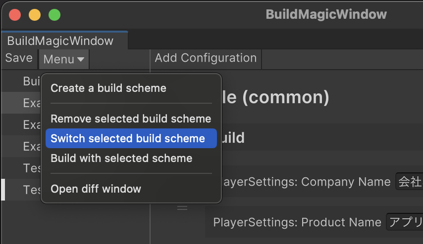

### Building from the UI

To build the app, click the `Menu` in the upper left corner of the BuildMagic window to expand the dropdown menu and select `Build with selected scheme`.

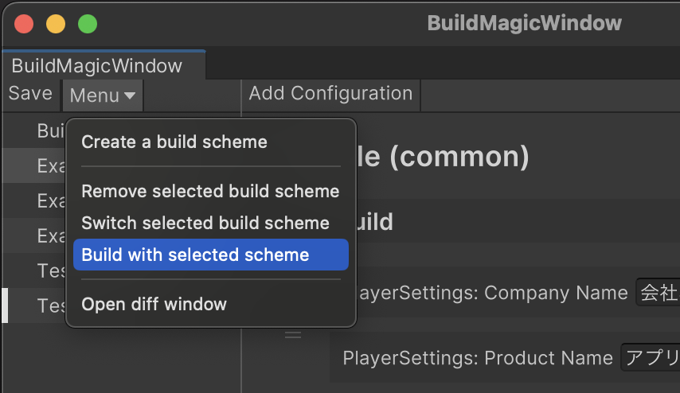

### Build Scheme Inheritance

You can inherit a build scheme and add or override each build configurations.

When creating a build scheme, specify the build scheme to inherit from as **Base**.

When selecting a build scheme that inherits from another build scheme on the UI, the build configurations included in the inherited build scheme are displayed in the **Derived** section.  
Settings are added or overridden on a **build configuration basis**.

You can also change the structure of inheritance by drag and drop build schemes on the tree view after the build scheme is created. Derived build schemes are located under the base build scheme in the tree view.

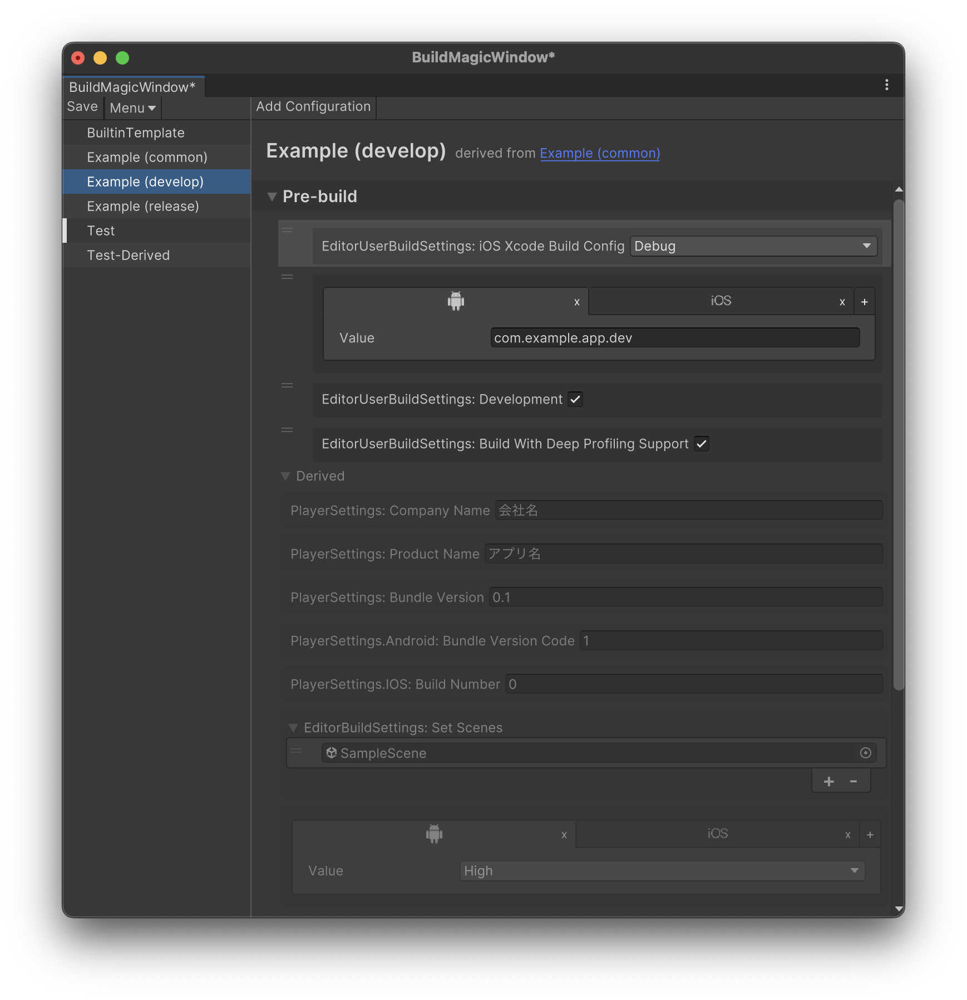

## Build Phases

BuildMagic supports execution via the command line.

Building the player from the command line is divided into two phases: the `Pre-build` phase and the `Post-build` phase.

- Pre-build phase:
    - A phase that switches the platform and applies build settings managed by BuildMagic to the project.
    - Updates to Define Symbols and physical deletion of assets and source code have to be performed in this phase.
- Post-build phase:
    - A phase that is executed after building the Unity app.

Executing via the command line involves running the Pre-build phase, restarting Unity, then building the player and running Post-build phase.

This approach is adopted because domain reloads cannot be performed in batch mode execution via the command line.
If you switch platforms and apply build settings in the same process as building, code recompilation may not be performed correctly, resulting in unexpected builds.

Reference: [Unity - Manual: Custom scripting symbols](https://docs.unity3d.com/Manual/CustomScriptingSymbols.html)

> So, for example, if you use this method in an Editor script, then immediately call BuildPipeline.BuildPlayer on the
> following line in the same script, at that point Unity is still running your Editor scripts with the old set of
> scripting symbols, because they have not yet been recompiled with the new symbols.
> This means if you have Editor scripts which run as part of your BuildPlayer execution,
> they run with the old scripting symbols and your player might not build as you expected.

### "Just before the build" phase

For advanced users, "Just before the build" phase is also available. It is useful to apply settings that are cleared when Unity is restarted.  
To enable this phase, select "Enable Just before the build phase (advanced)" menu in the BuildMagic settings.


## Command-line Arguments

The following is an example of building from the CLI on macOS.

```shell
# Running Pre-build phase
/Path/to/Unity -projectPath /Path/To/Project -quit -batchmode -executeMethod BuildMagicCLI.PreBuild \
  -scheme ${BUILD_MAGIC_SCHEME_NAME} \
  -override KEY1=VALUE1 -override KEY2=VALUE2

# Building the player and running Post-build phase
/Path/to/Unity -projectPath /Path/To/Project -quit -batchmode -executeMethod BuildMagicCLI.Build \
  -scheme ${BUILD_MAGIC_SCHEME_NAME} \
  -override KEY1=VALUE1 -override KEY2=VALUE2
```

The command-line options are as follows:

| Option       | Description                                                                                                          | Type         |
|:------------|:---------------------------------------------------------------------------------------------------------------------|:------------|
| `-scheme`   | Specifies the name of the build scheme to apply.                                                                     | string      |
| `-override` | Overrides the value of the build configuration.                                                                      | string      |
| `-strict`   | When enabled, if there is any error log output during the build, the build will fail regardless of the build result. | bool (flag) |

The return values from the command line are as follows:

| Return value | Description                           |
|:------------|:--------------------------------------|
| `0`         | Returned when the build is successfully completed. |
| `Non-zero`  | Returned when an exception is thrown during the build, etc. |

### Overriding Build Configuration at Build Time

Each setting value of the build configuration can be overridden at build time by specifying the `-override` option when executing the CLI.
`-override` is specified in the form of `KEY=VALUE`.

The KEY specifies the key value of the build scheme, which is the value specified in the `PropertyName` of the `GenerateBuildTaskAccessories` attribute attached to the class that inherits `BuildTaskBase<T>`.

The actual key value can be copied to the clipboard by right-clicking on the build scheme cursor in the BuildMagic window and selecting "Copy the configuration key".

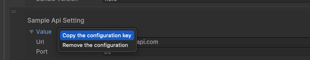

If there is no build configuration corresponding to the specified build scheme, a new build configuration will be created and the build task will be executed

## Build Tasks

In BuildMagic, build tasks are defined using `BuildTaskBase<T>`.

For example, the built-in task `PlayerSettingsSetProductNameTask` to set the application name is implemented by inheriting `BuildTaskBase<T>` as follows.

```csharp
[BuildMagicEditor.GenerateBuildTaskAccessories(@"PlayerSettings: Product Name", PropertyName = @"PlayerSettings.ProductName")]
public class PlayerSettingsSetProductNameTask : BuildMagicEditor.BuildTaskBase<BuildMagicEditor.IPreBuildContext>
{
    public PlayerSettingsSetProductNameTask(string productName)
    {
        this.productName = productName;
    }

    public override void Run(BuildMagicEditor.IPreBuildContext context)
    {
        UnityEditor.PlayerSettings.productName = this.productName;
    }
    private readonly string productName;
}
```

The type parameter `T` of `BuildTaskBase<T>` is the context type that represents the phase in which the task is executed.

In BuildMagic, build tasks are divided into the following three phases.

| Phase                                                                     | Description                           | ContextType         |
|:--------------------------------------------------------------------------|:--------------------------------------|:--------------------|
| Pre-build                                                                 | A phase to apply settings to the project. Executed before the build phase. | `IPreBuildContext`  |
| Just before the build [(hidden by default)](#just-before-the-build-phase) | A phase executed just before the build (after restarting Unity when using CLI)   | `IInternalPrepareContext` |
| Post-build                                                                | A phase executed after the application is built by the build player.   | `IPostBuildContext` |

In the Pre-build phase, settings are applied to the Unity project, such as reflecting various settings, applying Script Define Symbols, and updating C# code by excluding physical code.

In the Post-build phase, additional processing is performed on the built application or project.

### Implementing Custom Build Tasks

By defining custom build tasks, you can maintain and reflect project-specific settings.

For example, suppose you have a setting called `SampleApiSetting`.

```csharp
using System;
using UnityEngine;

[CreateAssetMenu(
    fileName = "SampleApiSettings",
    menuName = "Build Magic/Samples/Sample ApiSettings")]
[Serializable]
public class SampleApiSetting : ScriptableObject
{
    [SerializeField] public string Url;

    [SerializeField] public int Port;
}
```

To manage and reflect this setting with BuildMagic, you can implement a build task as follows.

```csharp
using BuildMagicEditor;
using UnityEditor;

// required to generate a build configuration, etc.
[GenerateBuildTaskAccessories(
    // display name in the UI
    "Sample Api Setting",
    // property name used for the key of CLI override
    PropertyName = "SampleApiSetting")]
public class SampleApiSettingBuildTask : BuildTaskBase<IPreBuildContext>
{
    private readonly string _url;
    private readonly int _port;

    // All required values for updating with this setting are taken as constructor arguments
    public SampleApiSettingBuildTask(string url, int port)
    {
        _url = url;
        _port = port;
    }

    public override void Run(IPreBuildContext context)
    {
        // Implement the process of reflecting the settings you have on the project in Run
        var setting = AssetDatabase.LoadAssetAtPath<SampleApiSetting>(
            "Assets/Settings/SampleApiSettings.asset");
        if (setting != null)
        {
            setting.Url = _url;
            setting.Port = _port;
            EditorUtility.SetDirty(setting);
        }
    }
}
```

The build task inherits `BuildTaskBase<T>` and specifies the context type applied to the phase in `T`. In the above implementation, `IPreBuildContext` is specified, so it is a build task executed in the pre-build phase.

To generate a build configuration and automatically generate build task accessories, add the `GenerateBuildTaskAccessories` attribute and the `BuildConfiguration` attribute.  
All required settings for this build task are taken as constructor arguments.

The actual build task processing is described in the `Run(T context)` method.

By implementing a build task in this way, you can add custom build configurations to BuildMagic as shown below.

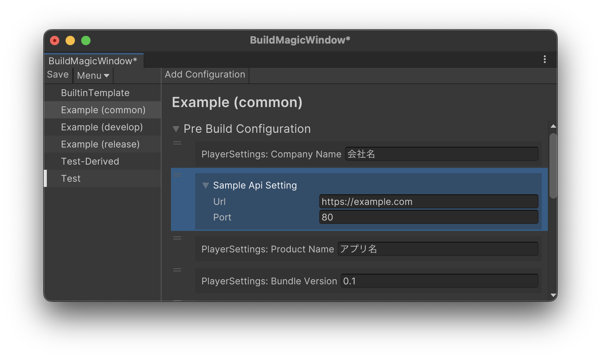

### Reflecting Project Settings in Build Configurations

By implementing `IProjectSettingApplier` for the generated build configuration, you can reflect project settings in the build configuration.

The following is an example of implementing `IProjectSettingApplier` for `SampleApiSettingBuildTaskConfiguration`.

```csharp
// SampleApiSettingBuildTaskConfiguration automatically generates a build configuration named SampleApiSettingBuildTaskConfiguration.
// This class is defined as partial, so implement IPorjectSettingApplier as follows.
public partial class SampleApiSettingBuildTaskConfiguration : IProjectSettingApplier
{
    void IProjectSettingApplier.ApplyProjectSetting()
    {
        // Refer to the project-side setting value
        var setting = AssetDatabase.LoadAssetAtPath<SampleApiSetting>("Assets/Settings/SampleApiSettings.asset");
        if (setting != null)
        {
            // Reflect the setting value in the Value property.
            // SampleApiSettingBuildTaskParameters is automatically generated for SampleApiSettingBuildTask.
            // By setting this value, the setting value is reflected in the build configuration.
            Value = new SampleApiSettingBuildTaskParameters
            {
                port = setting.Port,
                url = setting.Url
            };
        }
    }
}

```

### Built-in Build Configurations

The following build configurations are provided by BuildMagic:

- Build configurations applied in the pre-build phase
    - [PlayerSettings](https://docs.unity3d.com/ja/2022.3/ScriptReference/PlayerSettings.html)
    - [EditorUserBuildSettings](https://docs.unity3d.com/ja/2022.3/ScriptReference/EditorUserBuildSettings.html)
- Build configurations applied in the build phase
    - [BuildPlayerOptions](https://docs.unity3d.com/ja/2022.3/ScriptReference/BuildPlayerOptions.html)
